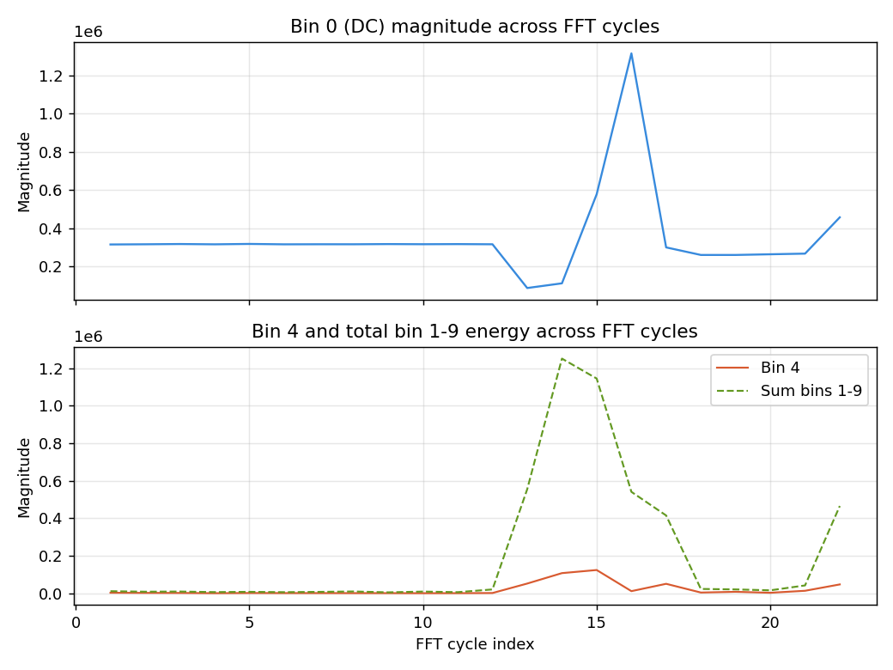

# Accel_FFT_Bringup

The de-risking project for the capstone. Before touching the ESP32 or any TinyML
tooling, this project answers one question on its own: can the STM32F407 actually
read the LIS3DSH on a DRDY interrupt, fill a sample buffer, run a CMSIS-DSP FFT on
it, and produce a sane magnitude spectrum over UART. Single axis (X), 512-point FFT,
DRDY-interrupt-driven sampling. Deliberately the simplest version of the pipeline so
any bug found here is unambiguous about where it lives.

## Hardware

- Board: STM32F4DISCOVERY (MB997-F407VGT6-E01)
- Sensor: LIS3DSHTR (onboard MEMS accelerometer)
- SPI1: PA5 = SCK, PA6 = MISO, PA7 = MOSI
- CS: PE3 (manual GPIO, no pull)
- DRDY: PE0 (EXTI, rising edge, no pull, routed from sensor INT1)
- UART debug: PA2 = TX, PA3 = RX via USART2 at 115200 baud

## Why these config choices

**400Hz ODR, not the 100Hz default.** Originally brought the LIS3DSH library over
at 100Hz (from the earlier interrupt-driven SPI project), which meant a 512-sample
buffer took 5.12 seconds to fill — too slow for fast iteration during bring-up.
Bumped to 400Hz: 512 samples = 1.28s per FFT, and Nyquist at 200Hz comfortably
covers expected fan vibration frequencies, which live well under that. CTRL_REG4 =
`0x77` (ODR bits `0111` = 400Hz, BDU + X/Y/Z enable in the low nibble).

**512-point FFT, single axis (X), DRDY-interrupt-driven sampling.** Three separate
decisions, made together for the same reason: isolate the FFT math as the only new
variable in this project. 512 balances frequency resolution against RAM/compute
cost for a bring-up step. Single axis avoids tripling buffers and SPI reads before
the core math is even proven. DRDY-interrupt reuses the proven pattern from the
earlier `SPI_LIS3DSHTR_INT` project instead of inventing a new timer-driven sampling
scheme. None of these are the final capstone config — see Lessons Learned.

**arm_rfft_fast_f32, not arm_cfft.** Real input data (accelerometer samples are
real, not complex), so the real-FFT variant is the right tool and roughly 2x more
efficient than running a full complex FFT on data with a zero imaginary part.

**Inline FFT processing, not double-buffered.** When the 512-sample buffer fills,
the FFT runs immediately in the main loop, blocking new sample collection until
done. For a bring-up step this is fine — there's no continuous streaming requirement
yet. Double-buffering (fill buffer A while processing buffer B) is the more
production-correct pattern and is flagged for the capstone integration stage.

## ISR / main loop structure

Same flag-based pattern as the earlier interrupt-driven SPI project:

```c
void HAL_GPIO_EXTI_Callback(uint16_t GPIO_Pin)
{
    if (GPIO_Pin == GPIO_PIN_0)
    {
        data_ready = 1;
    }
}
```

The ISR only sets a flag — no SPI calls inside it. SPI is comparatively slow and
HAL_SPI calls can block; running them inside an EXTI ISR risks starving other
interrupts. The actual `LIS3_ReadXYZ` call and buffer-fill happen in the main loop
when `data_ready` is set. Once the buffer reaches 512 samples, run the FFT and
magnitude conversion, then reset the index and start filling again.

## Building with CMSIS-DSP

CMSIS-DSP isn't added to a CubeMX project automatically just because it's an F4
chip — it's a separate `Drivers/CMSIS/DSP` tree that has to be copied in manually
from the local STM32Cube firmware package repository
(`~/STM32Cube/Repository/STM32Cube_FW_F4_V1.28.3/Drivers/CMSIS/DSP`).

**Do not compile the entire DSP `Source` tree.** It contains every function
category (Bayes, SVM, Quaternion, sorting, matrix, etc.) and most of it either
isn't needed or actively breaks the build:

- `ComputeLibrary` is a NEON/Arm-Compute-Library backend that doesn't target
  Cortex-M at all (`NEMath.h` not found).
- Some `SupportFunctions` files need `arm_sorting.h`, which lives in
  `PrivateInclude`, not on the normal include path.
- Every category folder has both individual `.c` files (`arm_rfft_q31.c`, etc.)
  **and** an umbrella file (`TransformFunctions.c`, `CommonTables.c`, ...) that
  itself `#include`s all the individual files. Compiling both gives "multiple
  definition" linker errors for every symbol in that folder.

The fix: exclude the whole `Source` folder from the build, then bring back only
what's actually needed. For `arm_rfft_fast_f32` on this chip, that ended up being:

- `TransformFunctions`: `arm_bitreversal.c`, `arm_bitreversal2.c`, `arm_cfft_f32.c`,
  `arm_cfft_init_f32.c`, `arm_cfft_radix8_f32.c`, `arm_rfft_fast_f32.c`,
  `arm_rfft_fast_init_f32.c`
- `CommonTables`: `arm_common_tables.c`, `arm_const_structs.c`
- `ComplexMathFunctions`: `arm_cmplx_mag_f32.c` (for magnitude conversion)

`arm_cfft_radix8_f32.c` and `arm_cmplx_mag_f32.c` weren't obvious dependencies up
front — both only showed up as "undefined reference" once the linker actually
needed them, which is the expected way to discover this rather than trying to
guess the full dependency tree in advance.

CubeIDE's per-file "Exclude resource from build" checkbox goes **non-interactive**
on a child file if the parent folder is itself excluded — there's no way to
selectively un-exclude one file inside an excluded folder through the GUI. Worked
around this by renaming unwanted files to `.c.bak` instead (`make` only picks up
`.c` files), which sidesteps the locked-checkbox problem entirely.

## Float printf

`%.2f` printed nothing usable on first try. The linker defaults to a stripped-down
printf via `--specs=nano.specs` that doesn't include float formatting. Fixed under
Project Properties → C/C++ Build → Settings → MCU/MPU Settings → ticked "Use float
with printf from newlib-nano (-u _printf_float)".

## What the data actually looks like

Bin 0 is the DC component — the sum of all 512 samples, dominated by the gravity
component sitting on the X axis. With the board resting, this is roughly
512 x (average X reading), which is why bin 0 is always two to three orders of
magnitude larger than every other bin. It carries no rotational/vibration
information and should be ignored when looking for actual signal content.

Bins 1 onward are real frequency content, spaced at
`sample_rate / FFT_size = 400 / 512 ≈ 0.78Hz` per bin. With the board just sitting
on a desk, bins 1-9 (under ~7Hz) showed small, constantly-varying values — this is
expected, not a bug. MEMS accelerometers have a real noise floor, and ambient
vibration (desk, building, footsteps) constantly perturbs a "still" sensor. Bin
values being different between back-to-back captures is the system actually working;
identical bins every time would suggest a stuck SPI read returning stale data,
not a quiet sensor.

Captured a tilt test to check the pipeline responds to a real physical event, not
just noise. Tilting the board partway through the capture changes how much of
gravity projects onto the X axis, so the DC bin should shift and there should be a
clear disturbance during the motion itself:



Top: bin 0 (DC) holding steady at ~315k, dropping sharply during the tilt motion,
then settling at a new baseline around ~262k once the board came to rest at the new
angle. Bottom: bin 4 and the summed energy across bins 1-9, both near-zero at rest
and spiking hard during the tilt motion itself, then relaxing to a baseline that's
still somewhat higher than the original (consistent with the new resting angle
projecting slightly differently onto X, or simply more residual settling
vibration). This confirms the pipeline can tell apart three real physical states —
still, moving, still-at-a-different-angle — which is the same kind of separation the
eventual fault classifier needs to make, just without any labels or thresholds
attached yet.

## Lessons learned

**A spike in the spectrum is not, by itself, a fault.** A healthy spinning fan
will always show a clear peak at its rotation frequency — that's physics, not a
problem. What actually distinguishes healthy from faulty is the *pattern*: an
imbalance fault (mass on a blade) tends to amplify the existing rotation-frequency
peak and its harmonics, since the unbalanced mass shakes harder at the same rate.
An obstruction fault tends to shift energy into different frequencies entirely, as
the motor strains against the blockage. Neither shows up as "is there a peak" —
hand-coded threshold rules would be fragile here, which is exactly why the capstone
plan puts a TinyML model on top of the FFT rather than trying to thresholds-and-if
the spectrum shape directly.

**TinyML doesn't filter out noise, it learns the shape of normal.** Training on
many "healthy" spectra teaches the model the envelope of normal variation (the same
kind of noise seen in this bring-up, bin-to-bin), so at inference time it's asking
"does this fall inside the range I've seen as healthy" rather than comparing
against one fixed reference. Explicit noise-reduction techniques (averaging
multiple FFTs together, high-pass filtering before the FFT, ignoring bin 0, a
window function before the transform) are complementary, not a replacement, and
are deferred to whichever mini-project actually starts training a model, since
adding them here would be guessing at requirements the training data hasn't
revealed yet.

**Single axis was the right call for bring-up, but the capstone needs all three.**
Picked X arbitrarily, before knowing where the fault signatures would actually be
strongest. An imbalance fault's wobble and an obstruction fault's altered motor
load won't necessarily show up on the same axis, and which axis matters most
depends on how the accelerometer ends up physically mounted relative to the fan's
blade plane and motor shaft — something that can't be known from theory alone.
Guessing a single axis now risks training the eventual model on a flat, uninformative
signal while missing the axis that actually carried the fault. Decided to keep this
project X-only (it had already done its job proving the FFT math) and treat 3-axis
capture as a deliberate, separate step during capstone integration rather than
folding it in here and blurring two different claims ("FFT works" vs "3-axis
capture works") into one.

**Stale build artifacts produce confusing linker errors that look like config
problems.** After changing which files were excluded from the build, an incremental
build (227ms, suspiciously fast) still showed errors that should have been fixed by
the exclusion change. A full Project → Clean followed by a separate Project →
Build Project resolved it. Worth remembering: if a build error doesn't match the
current file-exclusion state, clean before assuming the fix didn't work.